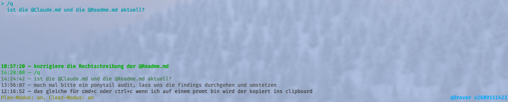

# qDrover

**qDrover** ("query drover") ist ein in Go geschriebenes "prompt-querying"-Tool mit dem sich Prompts erstellen, verwalten und an eine [Herdr](https://herdr.dev)-Pane in welcher Claude-Code ausgeführt wird senden lassen.



## Überblick

qDrover verwaltet pro Arbeitsverzeichnis ein Board aus Text-Prompts, die im Terminal angelegt, bearbeitet, sortiert und wieder gelöscht werden können. Ist zusätzlich [Herdr](https://herdr.dev) verfügbar, kann jeder Prompt per Tastendruck an eine benachbarte Herdr-Pane geschickt werden, optional mit vorangestellten `/plan`- oder `/clear`-Kommandos.

## Features

- **Board & Prompts** — Prompts anlegen, bearbeiten, verschieben und löschen
- **Undo/Redo** — Snapshot-basierter Verlauf über die letzten 50 Änderungen (`u`/`r`).
- **Markieren** — Prompts lassen sich mit der Leertaste dauerhaft markieren. Ein markierter Prompt übersteht das automatische Löschen beim Senden mit `s`/`S`.
- **Plan-Modus (`p`) und Clear-Modus (`c`)** — zwei unabhängig kombinierbare, persistente Umschalter. Sind beide aktiv, wird beim Senden erst `/clear`, dann `/plan`, dann der eigentliche Prompt-Text an die Ziel-Pane geschickt.
- **Sendehistorie** — die letzten 5 gesendeten Texte werden mit Zeitstempel im Footer angezeigt.
- **Sechs Sende-Tasten**, alle senden an die Nachbar-Pane in der jeweiligen Richtung bzw. nach oben:
  | Taste | Aktion |
  |---|---|
  | `s` | sendet nach oben, Prompt wird danach aus der Liste entfernt (Undo-fähig) |
  | `S` | sendet nach oben mit vorangestelltem `/subtask ` (z. B. `/subtask hallo welt`), Prompt wird danach entfernt (Undo-fähig), unabhängig von Plan-/Clear-Modus |
  | `shift`+`↑`/`↓`/`←`/`→` | sendet in die jeweilige Richtung, Prompt bleibt in der Liste |

## AI-Assistierte Entwicklung

> [!IMPORTANT]
> Dieses Projekt wurde mit erheblicher KI-Unterstützung erstellt, und das ist beabsichtigt und transparent.
>
> Teile der Codebasis wurden mit KI generiert, aber die Anwendung wurde nicht als ungeprüfter Output herausgegeben. Der generierte Code wurde von einem menschlichen Entwickler geprüft, korrigiert und validiert, bevor er veröffentlicht wurde.

## Voraussetzungen

- Go ≥ 1.23 (das Projekt selbst ist auf 1.24.0 gepinnt)
- [`go-task`](https://taskfile.dev) zum Bauen (empfohlen, siehe unten)
- Optional, nur für die Sendefunktion: eine installierte [`herdr`](https://herdr.dev)-Binary im `PATH` sowie die Umgebungsvariable `HERDR_ENV=1`

Ohne `HERDR_ENV=1` funktioniert qDrover weiterhin als reines lokales Board — nur das Senden an eine Herdr-Pane ist dann deaktiviert. Ist zusätzlich `QDROVER_DISABLE_HERDR` gesetzt, gilt das Gleiche als Kill-Switch, unabhängig von `HERDR_ENV=1`.

**Zwischenablage (`Shift+V`/`Shift+C`):**

- **Copy (`Shift+C`)** funktioniert über [OSC52](https://terminaltrove.com/docs/what-is-osc52) direkt durchs Terminal, auch über SSH, sofern der verwendete Terminal-Emulator OSC52 unterstützt
- **Paste (`Shift+V`)** braucht ein installiertes Clipboard-Tool **und** eine erreichbare X11- oder Wayland-Sitzung. Unter Alpine: `apk add xclip` (X11) oder `apk add wl-clipboard` (Wayland).

## Installation / Bauen

Mit `go-task` (bevorzugt):

```
task install     # baut dist/ und installiert das Linux-Binary nach ~/bin/qdrover
task dist-build   # Cross-Builds nach dist/ (Linux amd64, macOS arm64) — nicht installiert
task run          # TUI direkt starten, ohne Installation
task test         # go test ./...
task lint         # golangci-lint run
```

Ohne `go-task`-CLI direkt mit Go:

```
go build ./...
go run ./cmd/qdrover
go test ./... -v
go vet ./...
```

Beim regulären `go build`/`go run` bleibt die im TUI angezeigte Versionsnummer `dev`. `task dist-build` setzt sie per Linker-Flag (`-X main.version=...`) auf einen Zeitstempel der Form `vYYMMDDhhmm`.

## Bedienung / Tastenkürzel

Der vollständige Hilfetext ist jederzeit im TUI per `h` abrufbar:

**Navigation**
| Taste | Aktion |
|---|---|
| `j` / `↓` | einen Prompt nach unten |
| `k` / `↑` | einen Prompt nach oben |
| `g` | zum ersten Prompt |
| `G` | zum letzten Prompt |

**Bearbeiten**
| Taste | Aktion |
|---|---|
| `i` | neuen Prompt anlegen |
| `enter` | fokussierten Prompt bearbeiten |
| `d` | fokussierten Prompt löschen |
| `J` | Prompt nach unten verschieben |
| `K` | Prompt nach oben verschieben |
| `V` | Zwischenablage als neuen Prompt einfügen (braucht `xclip`/`xsel`/`wl-clipboard` + X11/Wayland) |
| `C` | fokussierten Prompt in Zwischenablage kopieren (auch über SSH per OSC52) |

**Im Editor**
| Taste | Aktion |
|---|---|
| `enter` | speichern & verlassen |
| `esc` | speichern & verlassen |
| `ctrl+j` | neue Zeile einfügen |

**Senden an Herdr-Pane**
| Taste | Aktion |
|---|---|
| `shift`+`↑`/`↓`/`←`/`→` | senden, Prompt bleibt in der Liste |
| `s` | nach oben senden, Prompt wird danach entfernt (Undo-fähig) |
| `S` | `/subtask` + Text nach oben senden, Prompt wird danach entfernt (Undo-fähig) |
| `leertaste` | Prompt markieren/entmarkieren (cyan) — überstimmt Löschen bei `s`/`S` |
| `p` | Plan-Modus umschalten (Ziel bekommt vor jedem Send erst `/plan`) |
| `c` | Clear-Modus umschalten (Ziel bekommt vor jedem Send erst `/clear`) |

**Verlauf**
| Taste | Aktion |
|---|---|
| `u` | Undo |
| `r` | Redo |

**Sonstiges**
| Taste | Aktion |
|---|---|
| `h` | diese Hilfe anzeigen |
| `q` / `ctrl+c` | beenden |

## CLI-Referenz

```
qdrover
```

Startet ohne Argumente das TUI und lädt bzw. erstellt das Session-Board für das aktuelle Arbeitsverzeichnis.

```
qdrover send [query] [--direction up|down|left|right]
```

Sendet einen einzelnen Prompt an eine Herdr-Pane, ohne das TUI zu öffnen. Die Query kommt aus den Argumenten oder, falls keine übergeben werden, aus stdin. `--direction` bestimmt die Ziel-Pane relativ zur aktuellen (Default: leer). Dieser Befehl kennt keinen Plan-/Clear-Präfix — den gibt es nur im TUI.

## Datenablage

Jede Session wird als JSON-Datei unter `~/.local/state/qdrover/sessions/` gespeichert, eine Session pro Arbeitsverzeichnis.
